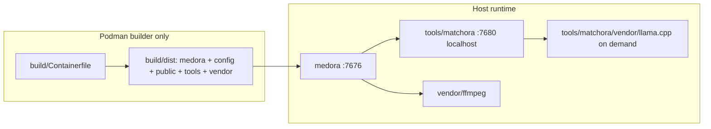

# Architecture

Medora is a self-hosted media library (scan, metadata, playback). A Podman **builder** writes `build/dist/`; runtime is the **host binary** (`./build/run`), not a container. Metadata lookup is delegated to first-party [Matchora](https://github.com/AlyShmahell/matchora) staged under `{exeDir}/tools/matchora/`. Third-party assets live under `{exeDir}/vendor/`.

## Layout

| Path | Role |
|------|------|
| `medora/cmd/medora` | HTTP server (`-config`, `--prepare`) |
| `medora/internal` | config, db, scan, fetch, stream, transcode, matchora client |
| `medora/web` | go:embed templates + first-party static (`app.css` / `app.js` / logos) |
| `medora/share/config` | Seed `default.yaml` copied into `build/dist/config` |
| `medora/share/applications` | `medora.desktop` staged to `{exeDir}/share/applications` |
| `install.sh` | TTY GitHub-release install into `~/.medora` (userscope desktop, icon, `~/.local/bin`) |
| `build/` | Podman dist builder: Containerfile, compose, host `run`, image helper `build` |
| `build/cache/` | Host cache (gitignored): ffmpeg bins + LICENSE reused across rebuilds |
| `{exeDir}/config` | Seed YAML (`-config` default `{exeDir}/config/default.yaml`) |
| `{exeDir}/public` | First-party static copy in the dist tree (templates stay embedded) |
| `{exeDir}/data` | SQLite store, transcode cache, backups, overlay `config.yaml`, Matchora `data/matchora` |
| `{exeDir}/tools/matchora` | First-party Matchora v0.0.3 (binary, `config/`, `public/`, `LICENSE`) |
| `{exeDir}/vendor` | Third-party only: htmx, video.js, hls.js, ffmpeg (+ licenses) |
| `tests/` | Podman unit (`go test`) + Playwright smoke against bind-mounted dist |

`tools/` is first-party helper programs. `vendor/` is third-party only. In the bundled tree, Matchora’s llama.cpp stays under `tools/matchora/vendor/` because that is Matchora’s own `{exeDir}` layout.

## Packages

The packager writes two archives with root `medora/` and Medora’s `LICENSE`:

| Archive | Contents |
|---------|----------|
| `medora-<ver>-linux-amd64.tar.gz` | binary, `config/`, `public/`, `tools/matchora/` (slim Matchora, no llama). **No** `{exeDir}/vendor/` |
| `medora-<ver>-linux-amd64-bundled.tar.gz` | same plus `{exeDir}/vendor/` (htmx, video.js, hls.js, ffmpeg + licenses) and `tools/matchora/vendor/llama.cpp` after `--prepare`, with llama/GGUF licenses fetched at pack time |

## HTTP

Medora is the only public listener (`:7676`). After listen it opens that URL in the browser when `DISPLAY`/`WAYLAND_DISPLAY` is set (`MEDORA_NO_BROWSER=1` skips). If the port is already in use, a second start opens the URL and exits. Matchora binds `127.0.0.1:7680` and is not a user-facing admin console.

| Method | Path | Role |
|--------|------|------|
| GET | `/` | home |
| GET | `/healthz` | process liveness |
| GET | `/about` | version + `{exeDir}/LICENSE` |
| GET/POST | `/settings/integrations` | webhooks (per user) and Matchora secrets (admin) |
| POST | `/play/{kind}/{id}/session` | direct or HLS playback session |
| GET | `/stream/{kind}/{id}` | byte-range original |
| GET | `/hls/{job}/…` | transcode playlist/segments |
| GET | `/static/vendor/*` | `{exeDir}/vendor` (htmx, video.js, hls.js) |
| GET | `/static/*` | embedded first-party static |

Playback uses **video.js** with **hls.js** attached to the video.js tech for HLS. Session, progress, prefs, VTT, chapters, and prev/next episode stay on Medora APIs.

## Libraries and scan

Libraries have a name and folder only — no movie/TV/anime type. **Local** scan uses one mixed disk walker: a directory is a show when it `looksLikeShowDir`, otherwise films. `media_items.kind` is `movie` or `show` from that detection.

**Scan with Matchora** does not run Medora’s mixed library walker. Medora sends `POST /v1/scan` with the library or item directory (jailed by `media.path` roots) and receives `202 {"session","files"}`. Matchora groups titles and matches; v0.0.3 scan jobs set `path` to the grouped child (folder or movie file) and typically omit `files[]`. Medora inventories videos **under `job.path`**, classifies movie vs show with the same `LooksLikeShowDir` rules as local scan, and numbers show episodes with the local ingest (SxxExx / Season N / sequential). When `files[]` is present, only video paths are used — never a directory as an episode. Persist-beside-media NFO/art stays in Medora when checked. Scan modal: **Local** vs **With Matchora**; overwrite existing metadata is a checkbox.

Matchora scan jobs are untyped (`source: "scan"`). `job.path` is the grouped child (folder or movie file). Anime provider `prefer` does not apply on untyped scan jobs (Matchora limitation).

## Matchora

On start Medora writes `tools/matchora/data/config.yaml` (optional `MEDORA_MATCHORA_OVERLAY` first, then `http.addr`, `data_dir: {exeDir}/data/matchora`, `browse_root` covering every `media.path` root — common ancestor, or `/` if disjoint) and spawns `{exeDir}/tools/matchora/matchora`. If a listener is already healthy, it is restarted so the new overlay loads. `Within("/")` treats every absolute path as inside the filesystem root. `--prepare` verifies that binary, fetches third-party `vendor/` if missing, runs `matchora --prepare` (llama.cpp under `tools/matchora/vendor/llama.cpp`), then exits.

Scan apply: `POST /v1/scan` `{"path":"<abs dir>"}` (must sit under `browse_root`) returns a session id (`<UTC datetime>-<16 hex chars>`). Poll `GET /v1/scan/status?session=` then `GET /v1/jobs?session=`. Jobs live in `{data_dir}/jobs-{session}.json` until `session.ttl_ms` (default and max 24h). Inventory is videos under `job.path` (or `files[]` video paths when Matchora sends them). **`matched`**: catalog fields from `GET /v1/catalog/{provider}/{id}?session=` (relative poster URLs are resolved against Matchora with the same query) joined by season-episode after Medora numbers files from the tree. **`manual`**: store the session and job id and still inventory the tree; Medora shows an orange `!` on the poster and a candidate picker (`POST /v1/jobs/{id}/select?session=`). **`unmatched` / `error`**: inventory only. Catalog episode stills are downloaded during apply; ffmpeg episode stills are not taken during Matchora apply (`-hide_banner -loglevel error`, seek retries). Provider keys come from Matchora `GET /v1/secrets` / `POST /v1/secrets` and are never stored in Medora YAML. Rows that have a job id but no session (pre-v0.0.3) need a rescan.

Medora owns SQLite, playback, persist-beside-media, ffmpeg stills, and the candidate picker UI. Matchora owns browse jail, directory walk, grouping, matching, catalog bytes, and path→catalog mapping. Do not `DELETE /v1/jobs?session=` while a manual pick may still be needed.

## Data and ffmpeg

Writable data defaults under `{exeDir}/data`. Overlay `{exeDir}/data/config.yaml` is merged after seed YAML. `MEDORA_MEDIA_PATH` / `media.path` is the library root (comma-separated paths are jailed separately but shown as one tree in the add-library picker). ffmpeg/ffprobe resolve to `{exeDir}/vendor/ffmpeg/` (`MEDORA_FFMPEG` override). `./build/run` drives Podman; the image runs `build/build stage`, which wipes `build/dist` first (including `data/`), then copies ffmpeg from `build/cache/ffmpeg` or compiles into that cache (static libx264, dynamic libva/libdrm). VAAPI probes host `/dev/dri` and needs host Mesa/`libva` (`libva.so.2`, `libdrm.so.2`). Software `libx264` is the fallback.

Idle HLS transcode jobs are cancelled a few minutes after last segment access. The process itself is not stopped when the browser is idle.
